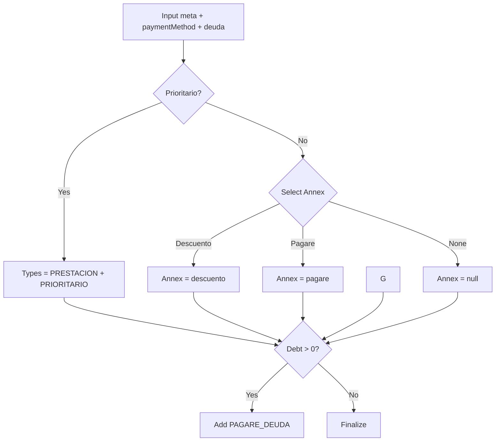

# Automatic Contract & Annex Generation Mapping

This document describes the rule engine that decides which `enrollment_documents` records are (re)generated automatically when the matrícula context changes.

## Core Principles

1. Idempotent updates: Unsigned documents are only rewritten when their rendered HTML hash changes.
2. Signed documents are immutable (never regenerated automatically).
3. Compact output: Annexes (descuento, pagaré, cheques) embed directly into the main `PRESTACION` document when possible to reduce document count.
4. Separation for prioritario & debt: `PRIORITARIO` and `PAGARE_DEUDA` always generate as separate documents because they have distinct legal semantics.

## Generated Document Types

| Type | Purpose | Generation Condition |
|------|---------|----------------------|
| PRESTACION | Base service / tuition contract + optional embedded annex | Always |
| PRIORITARIO | Ley SEP / alumno prioritario acknowledgment | `prioritario = true` |
| PAGARE_DEUDA | Debt regularization pagaré | `debtTotal > 0` |

Future types considered (not auto-generated yet): `PAGARE_REPACTACION`, `PAGARE` (standalone), additional declarations.

## Annex Embedding (Single Annex, Non-Prioritario Only)

When `prioritario = false` the engine embeds at most ONE annex into PRESTACION using precedence:

```
Descuento por Planilla > Pagaré
```

- Cheques never generates a separate annex page. The cheques detail always appears in the `cheques_table` within PRESTACION (when applicable).
- If `prioritario = true` → No annex embedded; PRESTACION remains base contract only (cheques table is typically omitted for prioritario).

## Decision Flow (Pseudo)



## Pure Planning Function

The rule logic is implemented in `src/services/autodoc.ts`:

```ts
computeEnrollmentDocumentPlan({ prioritario, paymentMethod, descuentoPlanilla, debtTotal })
// => { types: string[], prestacionAnnex: 'descuento'|'pagare'|'cheques'|null }
```

`ensureEnrollmentDocuments` uses this plan to render/update the actual Supabase rows.

## Invariants & Edge Cases

- `debtTotal` <= 0 → no `PAGARE_DEUDA` doc.
- Multiple payment flags set → only highest precedence annex embedded.
- Prioritario with discount flag still produces separate PRIORITARIO and no embedded annex.
- Removal of a flag (e.g. unchecking descuento) will regenerate PRESTACION without its previous annex (hash change triggers update).

## Hashing & Idempotency

Before upserting a document the engine computes a SHA-256 of its full HTML. If hash unchanged the row is left untouched unless status transitioned manually.

## Future Extensions

- Introduce ENUM type for `enrollment_documents.type` (currently expanded CHECK constraint) for better schema introspection.
- Add standalone generation for `PAGARE_REPACTACION` when a formal renegotiation workflow is implemented.
- Persist annex selection snapshot inside `generated_payload` for auditing which annex was embedded historically.

## Testing

Unit tests (`src/services/__tests__/autodoc.test.ts`) cover:
- Prioritario suppression of annexes.
- Annex precedence ordering.
- Debt triggering `PAGARE_DEUDA` addition.

Add integration tests later to assert Supabase rows match plan after UI interactions.

---
Last updated: 2025-11-10
